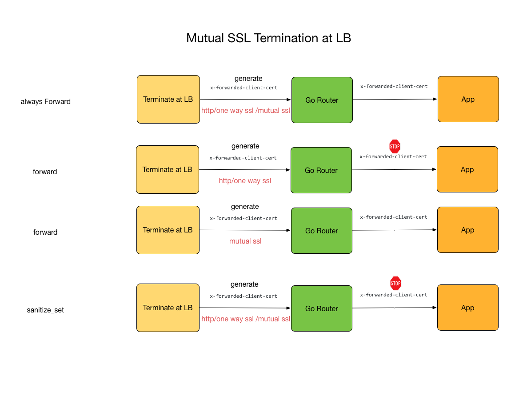
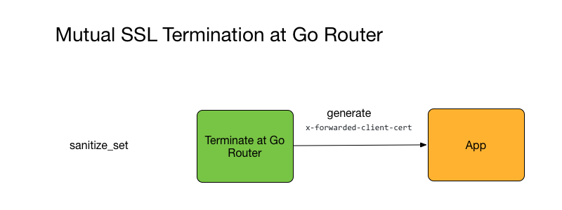

## Mutual SSL Through Go Router with boot app

### What does Cloud Foundry offer here

* [Bosh trusted certs](https://bosh.io/docs/trusted-certs.html)

* [Java Buildpack](https://github.com/cloudfoundry/java-buildpack/blob/master/docs/framework-container_security_provider.md#security-provider) add both diego identity key/cert to keystore and bosh trusted certs to truststore.

* [Forward Client Certs](http://docs.cloudfoundry.org/concepts/http-routing.html#forward-client-cert)

### What does this demo do

* One front end Application (client) with /hello endpoint.
* One Backend application (server) with /hello endpoint.
* Client use restTemplate to communicate with server through mutual SSL
* The mutual SSL handshake happens either at LB or Gorouter
* Enable java ssl debug

### Decide where are you going to terminate the SSL

Gorouter modes: always_forward, forward, and sanitize_set

* Terminate SSL at Load Balancer in front of gorouters

  

  Brief Requirements on LB:

  LB Request client certs **optional**. After termination, forward client certs content (BASE64 encoding on der format) to gorouter. The http header is X-Forwarded-Client-Cert

  In **forward** mode, gorouter will strip the X-Forwarded-Client-Cert header **unless** between LB and gorouter is mutual ssl

* Terminate SSL at gorouter directly

  

  Use **sanitize_set**. Gorouter will strip any X-Forwarded-Client-Cert header passed in from frontend and generate the header through mutual ssl.

### Install Client Root Cert to Go Router or LB

* Push the server app

  ```
  mvn clean package && cf push
  ```

* Start the client app without client cert installed

  ```
  ./start_client.sh
  ```

  ```
  Shaozhen-Ding-MacBook-Pro-3:no-mutual-ssl sding$ curl http://localhost:8082/hello
{"timestamp":1506025127062,"status":500,"error":"Internal Server Error","exception":"org.springframework.web.client.HttpClientErrorException","message":"403 Forbidden","path":"/hello"}
  ```

* Start the client app with client cert installed

```
MUTUAL_AUTH=true ./start_client.sh
```

```
curl http://localhost:8082/hello
Thanks for authenticating with X509, certificate CN is: client.mutual.shaozhenpcf.comShaozhen-Ding-MacBook-Pro-3:no-mutual-ssl sding$
```
